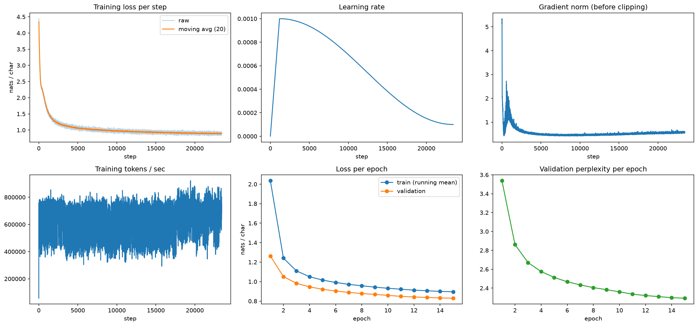

# Task 1 results: character-level GPT on TinyStories (run `main`)

Every number below comes from `metrics_report.csv`, `outputs/ablation_table.csv`, `config.yaml`,
`data_processed/split_info.json`, the raw logs in `../reproducibility/raw_logs/` or the manifests in
`../reproducibility/manifests/`.

## Setup

- **Model type:** character-level GPT (decoder-only Transformer, written by hand in PyTorch).
- **Data:** `TinyStoriesV2-GPT4-valid.txt` (27,630 stories after splitting on `<|endoftext|>`).
- **Vocabulary:** 83 characters, built from the training and validation text together. It includes rare
  non-ASCII characters (é, ñ, – , —, ‘, ’, “, ”, …), kept exactly as they appear in the text.
- **Split sizes:** 100K train / 10K validation are interpreted as **sequences of 128 characters**
  (`split_unit: sequences`, `block_size: 128`). The text is cut into chunks of
  100,000 × 128 + 1 = 12,800,001 train characters and 10,000 × 128 + 1 = 1,280,001 validation characters.
- **Contiguous split with a story-boundary gap:** a seeded story index (`first_story_index` = 10030) starts one
  contiguous train chunk. Validation starts at the next story boundary after the train chunk ends, so the story that
  straddles the end of the train chunk is dropped (470 characters between train and validation,
  `dropped_chars_between_train_and_val`). The notebook also checks that the start of the validation text does not
  occur in the training text.
- **Hardware / precision:** NVIDIA RTX 4090 (24 GB), fp16 autocast with a `GradScaler` (bf16 is not used).
- **Install note:** a plain `pip install torch` on this Windows machine gives the CPU-only build
  (`2.14.1+cpu`, `cuda_available=False`). The CUDA build must be installed from the PyTorch index
  (`2.14.1+cu130` from `https://download.pytorch.org/whl/cu130`, which matches the driver's CUDA 13.3).

## Architecture and hyperparameters (`config.yaml`)

| Item | Value |
|---|---|
| Block type | pre-LayerNorm Transformer blocks, GELU, causal self-attention |
| d_model | 128 |
| Layers | 4 |
| Heads | 4 |
| FFN width | 512 (4 × d_model) |
| Dropout | 0.2 |
| Tied embeddings | false |
| Init std | 0.02 |
| Parameters | 830,976 |
| Block size | 128 |
| Batch size | 64 |
| Epochs | 15 (1,562 steps per epoch, 23,430 steps in total) |
| Optimizer | AdamW, betas (0.9, 0.95), weight decay 0.1, grad clip 1.0 |
| Learning rate | peak 1e-3, cosine decay to 0.1 × peak |
| Warm-up | 5% of steps (1,172 steps) |
| Seed | 8893 |

## Metrics (`metrics_report.csv`, rows with setting `all`)

`metrics_report.csv` has 18 rows with setting `all` (the request mentioned 12); all 18 are listed here.

| Metric | Value | Notes |
|---|---|---|
| val_loss | 0.83012515 | nats per character, fixed validation windows |
| val_perplexity | 2.2936058 | exp(val_loss) |
| val_bpc | 1.1976174 | val_loss / ln 2 |
| train_loss_eval_mode | 0.80998349 | fixed train windows, dropout off |
| generalization_gap | 0.020141658 | val_loss − train_loss |
| val_top1_accuracy | 0.73917344 | argmax(logits) == target |
| train_top1_accuracy | 0.74379297 | fixed train windows, dropout off |
| param_count | 830976 | |
| train_tokens_per_sec | 649526.16 | mean over training steps |
| peak_gpu_memory_mb | 324.36914 | torch.cuda.max_memory_allocated |
| total_train_time_sec | 303.23195 | wall clock, includes per-epoch validation |
| nonfinite_steps | 6 | steps with NaN/inf loss or grad norm |
| max_grad_norm | 5.34267 | largest finite grad norm before clipping |
| best_epoch | 15 | |
| epochs_completed | 15 | |
| checkpoint_evaluated | best | saved at epoch 15 |
| split_unit | sequences | train_size=100000, val_size=10000 |
| vocab_size | 83 | |

Generation metrics per decoding setting (distinct-n, repeated 4-gram rate, generation speed) are in
`metrics_report.csv`.

Loss curves: 
(`outputs/main_loss_curves.png`)

## Ablations (`outputs/ablation_table.csv`)

All ablations use the same seed, split, batch size, learning rate and 15 epochs as `main`; only the listed value
(and the run name and output paths) changed.

| run | changed | params | best val loss | ppl | bpc | train loss | gap | time (s) | peak MB | nonfinite |
|---|---|---|---|---|---|---|---|---|---|---|
| main | layers 4, heads 4, dropout 0.2 | 830,976 | 0.830125 | 2.2936 | 1.1976 | 0.809983 | 0.020142 | 303.2 | 324.4 | 6 |
| abl_layers2 | n_layers=2 | 434,432 | 0.966198 | 2.6279 | 1.3939 | 0.949978 | 0.016220 | 181.6 | 247.2 | 7 |
| abl_layers6 | n_layers=6 | 1,227,520 | 0.778688 | 2.1786 | 1.1234 | 0.757909 | 0.020780 | 425.7 | 462.1 | 7 |
| abl_heads2 | n_heads=2 | 830,976 | 0.841505 | 2.3199 | 1.2140 | 0.822600 | 0.018905 | 296.3 | 268.4 | 7 |
| abl_heads8 | n_heads=8 | 830,976 | 0.842902 | 2.3231 | 1.2161 | 0.823889 | 0.019012 | 284.2 | 457.3 | 7 |
| abl_dropout0 | dropout=0.0 | 830,976 | 0.743865 | 2.1041 | 1.0732 | 0.710144 | 0.033721 | 280.8 | 300.4 | 10 |
| abl_dropout0p2 | dropout=0.2 (same as main) | 830,976 | 0.830161 | 2.2937 | 1.1977 | 0.810647 | 0.019514 | 304.9 | 324.4 | 7 |

Train loss is the eval-mode train loss (dropout off).

Reading:

- **Layers:** more layers lowered the validation loss with diminishing returns: 2 layers 0.966, 4 layers 0.830,
  6 layers 0.779. The step from 2 to 4 layers lowered it by 0.136, and the step from 4 to 6 by 0.051. Training
  time grew from 181.6 s to 303.2 s to 425.7 s.
- **Heads:** 2, 4 and 8 heads gave validation losses of 0.8415, 0.8301 and 0.8429. The parameter count is the same
  (830,976) because d_model stays at 128, and the differences are small.
- **Dropout:** dropout 0.0 gave a validation loss of 0.744 against 0.830 at dropout 0.2, and a lower train loss
  (0.710 against 0.810). The generalization gap rose from 0.020 to 0.034. Lower loss on both sets when dropout is
  removed suggests the model is underfitting rather than overfitting at this size and training length.
- **Repeat of main (same seed):** `abl_dropout0p2` uses the same config and the same seed (8893) as `main` under a new
  run name. Validation loss was 0.83016141 against 0.83012515 for `main`, a difference of 0.000036, and eval-mode train
  loss was 0.8106472 against 0.80998349. This is a same-seed repeat, so it shows how much the GPU run varies
  from nondeterminism alone (the runs are not bit-identical). It is not a multi-seed comparison and gives no
  seed-variance figure.

## Stability

`nonfinite_steps` was 6 for `main` and 7, 7, 7, 7, 10 and 7 for the six ablations (10 for dropout 0.0).

Check against the raw step logs (`../reproducibility/raw_logs/<run>_steps.csv`), in every run:

- The number of rows flagged `nonfinite = 1` matches the `nonfinite_steps` value in the summary
  (6 for main; 7, 7, 7, 7, 10, 7 for the ablations).
- In every flagged row the loss is finite and the logged `grad_norm` is `inf`. For example, in `main` the flagged
  steps are 10032, 12260, 14355, 16491, 18498 and 19449, with losses between 0.866899 and 1.003751.
- No row in any step log has a NaN or inf loss, and the epoch logs contain no NaN.
- In the training loop (`task1_gpt.ipynb`), gradients are unscaled with `scaler.unscale_` and then `scaler.step`
  is called. That call skips the optimizer update when the gradients contain inf or NaN, and `scaler.update` lowers
  the scale. This is consistent with the flagged steps being fp16 GradScaler overflow steps whose update was skipped.
  The logs do not record the skip itself, so this part is inferred from the code and the `inf` gradient norms.
- The flagged steps start around epoch 4 to 7 depending on the run, and training and validation loss stayed finite and kept falling.

So: no NaN losses, and the non-finite steps are overflow in the fp16 gradients, a few per run out of 23,430 steps.

## Limitations

- **Single seed:** only seed 8893 was used for all runs. The only repeat is the same-seed repeat of the main config
  (`abl_dropout0p2`, validation loss 0.83016141 against 0.83012515, a difference of 0.000036), which reflects GPU
  nondeterminism, not seed variance. The ablation table therefore has no seed-variance estimate.
- **Training stopped while still improving:** the best epoch is the last one (15) in every run. In `main`, validation
  loss was 0.832218 at epoch 14 and 0.830125 at epoch 15, so more epochs would probably lower it further.
- **Greedy decoding repeats:** the mean repeated 4-gram rate is 0.599 for greedy decoding against 0.0467 at
  temperature 0.7, 0.0168 at 1.0 and 0 at 1.2. Examples are in `failure_analysis.md`.
- **Small data and model:** 100,000 sequences of 128 characters, 830,976 parameters, one dataset.
- **Metrics were measured on one validation set** of 10,000 sequences; no separate test set was evaluated.
